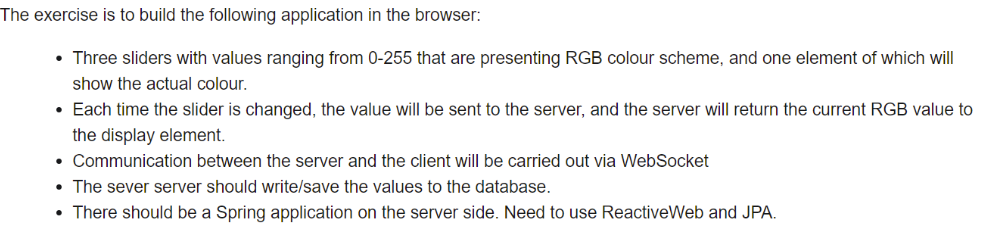
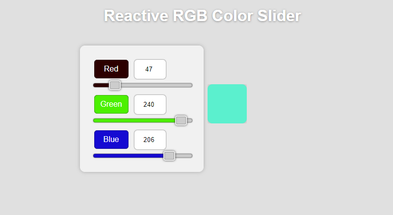

# rgb-reactive-websocket-mongo

# Slider App Task
What is required:        |
:---------------------:
 

### Screenshots
Screenshot UI           |
:---------------------:
 

### Requirements 🔧
* Java version 8 or higher.

### Installation 🔌
1. Press the **Fork** button (top right the page) to save copy of this project on your account.

2. Download the repository files (project) from the download section or clone this project by typing in the bash the following command:

       https://github.com/tvuchova/rgb-reactive-websocket-mongo.git
3. Imported it in Intellij IDEA or any other Java IDE.
4. Run the application :D
5. Start in browser https://github.com/tvuchova/rgb-reactive-websocket-mongo/blob/master/src/main/resources/static/index.html
### Technology 💡

Here we will create a simple small example on WebSocket on Spring MongoDB Reactive Programming, 

We are using here MongoDB as a persistence storage.

